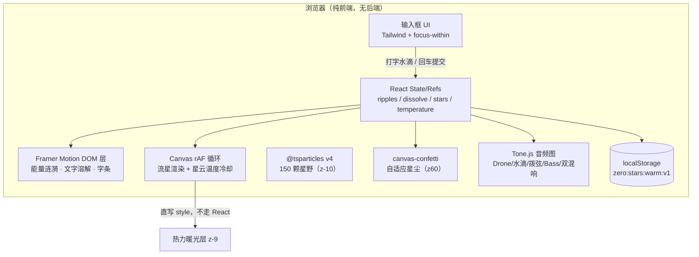
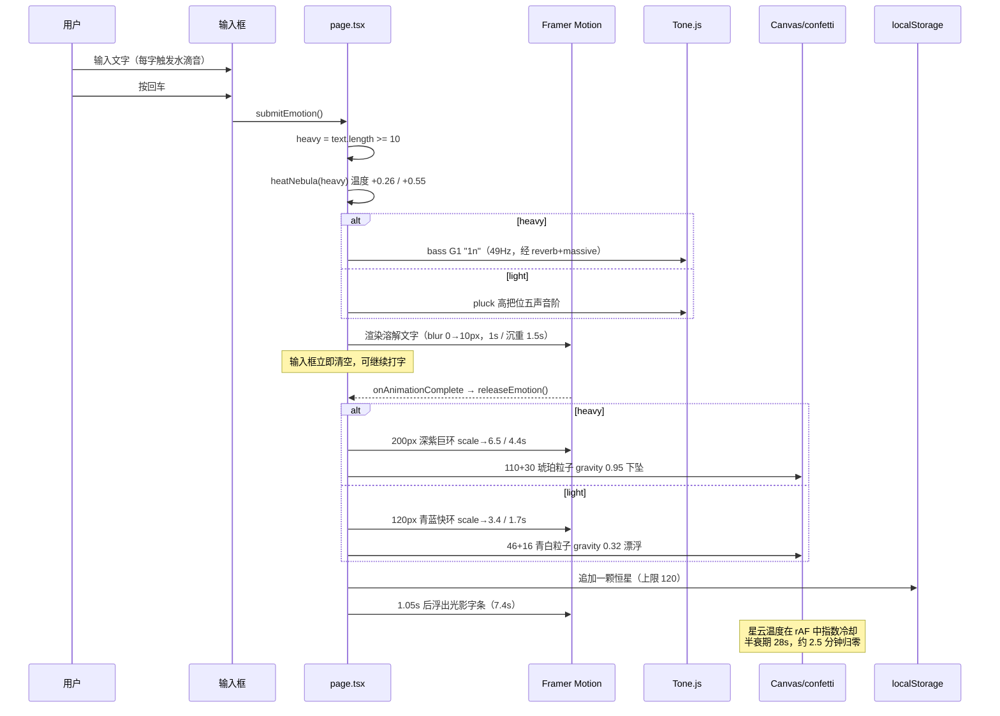
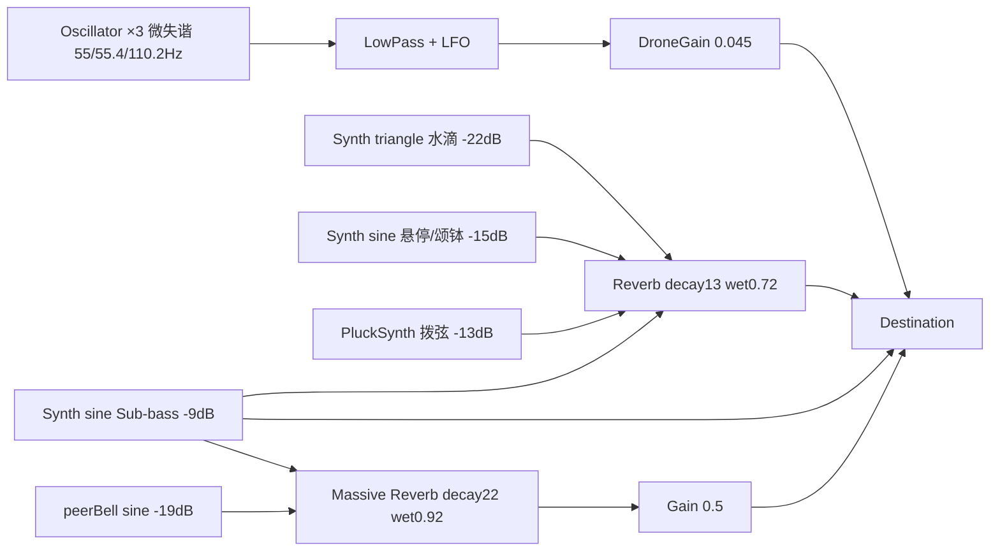

# 归零 Zero — 开发文档

> 一片可以把情绪丢进去的浩瀚深空。
> 线上地址：<https://xiaozeng2026.github.io/-zero-app-/>
>
> 当前版本：终极形态「宇宙深海 × 情绪自适应 × 星云热力学 × 同辈之网」
> 文档生成日期：2026-10-01

---

## 1. 项目概述

「归零」是一个**零后端、零账号、零成本**的纯前端情绪承接 Web 应用。界面只有一个底部透明输入框：用户打字时有声、回车时文字溶解、情绪化为星尘与涟漪、最终凝成星穹中一颗持久的恒星。

设计三原则：

1. **极简 UI**——无按钮、无菜单、无说明文字，唯一可交互控件是输入框。
2. **冷色宇宙 + 暖色锚点**——深空蓝紫为底，情绪落点（恒星/文字/爆发）始终是暖金。
3. **被陪伴而不被打扰**——所有自动事件（流星、同辈涟漪）微弱、随机、低频。

---

## 2. 技术栈

| 类别 | 选型 | 版本 | 用途 |
|---|---|---|---|
| 框架 | Next.js（App Router，静态导出 `output: "export"`） | 16.3.6 | 单页渲染、产物为纯静态文件 |
| 语言 | TypeScript | ^5 | 全量类型 |
| UI | React | 19.2.8 | 状态与组合 |
| 样式 | Tailwind CSS（`@import "tailwindcss"` v4 模式） | ^4 | 原子类 + 少量自定义关键帧 |
| 星空 | @tsparticles/react + @tsparticles/slim（**v4**） | ^4.4.0 | 150 颗星点粒子层 |
| 动效 | framer-motion | ^13.4.4 | DOM 能量涟漪、文字溶解、字条、星云呼吸 |
| 星尘 | canvas-confetti | ^1.9.4 | 回车时的自适应粒子爆裂 |
| 音频 | Tone.js | ^15.1.22 | Drone / 水滴 / 拨弦 / Sub-bass / 混响风铃 |
| 图标 | lucide-react | ^1.49.0 | **已安装但当前未引用**（预留） |

> ⚠️ 不要安装或恢复 `react-tsparticles` / `tsparticles` v2。v4 引擎的安装脚本会检测废弃包并导致 `npm ci` 失败、CI 挂起。

---

## 3. 目录结构

```text
zero-app/
├── .github/workflows/deploy.yml   # GitHub Pages 自动部署
├── next.config.ts                 # output:"export" + BASE_PATH 子路径注入
├── postcss.config.mjs             # Tailwind v4 PostCSS 插件
├── package.json
└── src/
    ├── app/
    │   ├── layout.tsx             # 根布局：元信息、viewport、黑底
    │   ├── globals.css            # Tailwind 主题令牌 + 星云漂移/流光关键帧
    │   └── page.tsx               # ★ 首页与全部核心逻辑（唯一活跃入口）
    ├── components/
    │   ├── StarfieldBackground.tsx # ★ 星空底座（渐变 + 星云 + tsparticles）
    │   ├── ZeroSpace.tsx           # ┐
    │   ├── EmotionCanvas.tsx       # ├ 旧版组件群：当前版本未引用（死代码）
    │   ├── DissolvingInput.tsx     # │ 改动时勿误伤，也不要在本次任务中顺手删除
    │   └── WhisperPhrase.tsx       # ┘
    └── lib/
        ├── generativeAudio.ts      # ┐ 旧版音频/星穹/语料模块：仅被旧组件引用
        ├── stars.ts                # ├ 当前 page.tsx 已内联等价逻辑，不依赖它们
        └── whispers.ts             # ┘
```

核心代码集中在两个文件：

- `src/app/page.tsx`（约 950 行）：状态、音频引擎、三层定时器、Canvas 流星、自适应爆发、输入框。
- `src/components/StarfieldBackground.tsx`：纯展示星空底座。

---

## 4. 系统架构

### 4.1 分层总览（Mermaid）



### 4.2 视觉层级（z-index 约定）

| z-index | 层 | 说明 |
|---|---|---|
| `-10` | 星空底座 | 径向渐变 + 呼吸星云 + tsparticles |
| `-9` | 星云热力层 | 回车加热后的暗红/琥珀暖光，rAF 直写 opacity/scale |
| `4/5` | 流星 Canvas | 仅负责流星拖尾与头部亮核 |
| `6` | DOM 能量涟漪 | 点击/回车/同辈三类波纹 |
| `10` | 恒星星穹 | localStorage 持久化恒星，可悬停发声 |
| `20` | 光影字条 + 溶解文字 | 居中浮字 |
| `30` | 输入框 | 唯一可交互控件 |
| `60` | confetti | 星尘爆裂（canvas-confetti 内置 zIndex） |

所有特效层默认 `pointer-events: none`；点击交互通过 **window 上的 `pointerup` 监听**统一处理，并对 `input, button, a, p` 做豁免。

### 4.3 回车端到端时序



---

## 5. 核心逻辑

### 5.1 星空底座（StarfieldBackground）

- 底色：`radial-gradient(ellipse 120% 100% at 50% 42%, #020111, #01010a 48%, #000 82%)`。
- 两团星云：左上紫 `rgba(138,92,214)` / 右下蓝 `rgba(37,99,196)`，`blur(120px)`，Framer Motion 10s **反相** opacity+scale 呼吸。
- tsparticles v4 用法（注意 Provider 包裹）：

```tsx
<ParticlesProvider init={async (engine) => { await loadSlim(engine); }}>
  <Particles id="zero-starfield" options={options} />
</ParticlesProvider>
```

关键参数：150 颗、`size 0.4–1.6`、`links.enable = false`、`move.direction = "top"` + `random`、speed 0.1–0.3、twinkle 谷底 0.1。

### 5.2 能量涟漪（RippleWave 组件）

- 数据模型：

```ts
interface RippleFx {
  id: number; x: number; y: number;
  tone: "violet" | "cyan" | "gold";
  supernova: boolean; dim: boolean;
  size?: number; scaleTo?: number; duration?: number; peak?: number; // 自适应覆盖
}
```

- 渲染：每个涟漪是两个 `motion.div` 圆环（外环 + 延迟 0.18s 的内环 0.62 倍），`box-shadow` 外发光 + inset 内发光 + radial-gradient 芯。
- 状态数组硬上限 **25** 个（`slice(-24)`）；外环 `onAnimationComplete` 时按 id 清除，避免内存与 DOM 堆积。
- 三种来源：

| 来源 | 触发 | 参数 |
|---|---|---|
| 指尖点击 | window `pointerup` | 随机 violet/cyan，scale→4，2.5s，peak 0.6，同时播放颂钵 |
| 回车释放 | `releaseEmotion` | 轻：cyan 120px→3.4/1.7s；重：violet 200px→6.5/4.4s |
| 同辈之网 | 独立慢定时器 | 105px→2.8/3.8s，peak 0.1–0.2，屏幕边缘 |

### 5.3 情绪自适应（Adaptive Resonance）

分档阈值常量 `HEAVY_THRESHOLD = 10`（按 `text.trim().length`，即字符数，中英文等价）。

| 维度 | 轻度 (<10) | 沉重 (≥10) |
|---|---|---|
| 星尘颜色 | 青蓝亮白 `CONFETTI_LIGHT` | 暗金琥珀 `CONFETTI_HEAVY` |
| 粒子数量 | 46 + 16 逃逸 | 110 + 30 余烬 |
| 重力 gravity | 0.32（失重漂浮） | 0.95（明显下坠） |
| ticks | 200 | 300 |
| 音色 | `Tone.PluckSynth`（Karplus-Strong 拨弦） | `Tone.Synth` 正弦 G1（49Hz）`"1n"` |
| 涟漪 | cyan 120px / scale 3.4 / 1.7s | violet 200px / scale 6.5 / 4.4s / 39px 强辉光 |
| 文字溶解时长 | 1s | 1.5s |
| 星云加热量 | +0.26 | +0.55 |

### 5.4 星云热力学（Non-linear Energy Dissipation）

- 温度存于 `nebulaTempRef`（**ref 而非 state**，取值 0–1），避免 60fps 触发 React 渲染。
- 加热：回车时 `T = min(1, T + Δ)`。
- 冷却：复用流星 Canvas 的 `requestAnimationFrame(ts)` 循环，按真实时间差做**指数衰减**：

```ts
T *= Math.pow(0.5, dt / NEBULA_COOL_HALFLIFE); // 半衰期 28 秒
if (T < 0.002) T = 0;                          // 死区，彻底归零
```

5 个半衰期 ≈ 140 秒（约 2.5 分钟）回冰冷深空；前期降得快、后期尾韵极长，符合「非线性极慢冷却」。
- 输出：变化量超过 0.003 时才直写热力层 DOM：`opacity = T*0.85`、`transform = scale(1 + T*0.22)`。热力层为 blur(70px) 的暗红→琥珀径向渐变，位于 z-9。
- `dt` 用 `Math.min(0.1, …)` 钳制，切后台造成的大时间跳变不会让温度瞬间清零。

### 5.5 同辈之网（Silent Peer Support Network）

- 独立 `useEffect` 中的 **setTimeout 自调度链**（与流星/近场共鸣调度器完全分离），间隔 `15000 + random*30000` ms（15–45s）。
- 坐标：屏幕四条极边缘带（左右各 8% 宽、上下各 12% 高）内随机一点。
- 视觉：近乎透明的紫/青小涟漪（peak 0.1–0.2）。
- 听觉：`peerBell`（正弦、-19dB）随机五声音阶，只送入 **Massive Reverb**（decay 22s，wet 0.92，经 Gain 0.5 输出）。
- `document.hidden` 时跳过本轮（不发声、不生成），定时器继续走。

> 另有「近场共鸣」调度器（5–12s，开启减弱动效时 11–19s）：65% 生成 Canvas 流星（25% 金色）、35% 生成普通暗涟漪，播放常规 bell。两套循环寓意不同，勿合并。

### 5.6 生成式音频（Tone.js 音频图）



关键约束：

- 首次 `pointerdown`/`keydown` 时 `await Tone.start()` 懒初始化（浏览器自动播放策略），Promise 缓存保证幂等；两个 Reverb 顺序 `await reverb.generate()`。
- 所有 `triggerAttackRelease` 必须使用 `claimTime()` 返回的**严格递增时间戳**：

```ts
const t = Math.max(Tone.now(), nextNoteTimeRef.current + 0.001);
```

否则快速连点会抛 `Start time must be strictly greater than previous start time`。

- Drone：3 支振荡器（第三支 110.2Hz 增益 0.25）→ 低通 150Hz → 0.08Hz LFO 让截止频率 90–220Hz 呼吸；初始化后 6s 淡入到 0.045。

### 5.7 星穹与本地持久化

- Key：`zero:stars:warm:v1`；仅客户端 `useEffect` 内读取，规避 SSR hydration mismatch。
- 结构：

```ts
interface Star {
  id: string;
  x: number; // 视口宽度百分比
  y: number; // 6–40，只落上半屏
  size: number; color: string;
  twinkle: number;  // 闪烁周期（秒），落盘以保持稳定
  timestamp: number;
}
```

- 每次回车落一颗（位置/大小/色/周期随机），写入前 `slice(-120)` 限流；`setItem` 包 try/catch，存储不可用也不影响体验。
- 悬停/触摸恒星：放大发亮 + `touchStar()`（0.12s 节流）随机五声音阶。

### 5.8 光影字条

回车后 1.05s 浮出，从 5 条低语中抽取且**不与上一条重复**；Framer Motion 7.4s 时间轴：blur(10→2→2→14px)、opacity `[0,1,1,0]`，结束 `setWhisper(null)`。

### 5.9 输入框视觉（纯 CSS，零状态）

容器 `group` + `focus-within` 实现三态，不增加任何 React 状态：

- 静息：112px（w-28）发丝横线、两端微光星点、背后暖光 opacity 0.3。
- 聚焦：文字暖金辉光（text-shadow 14→26px）、横线延展至 288px（w-72）并透琥珀辉光、星点放大点亮、暖光晕全亮、`.zero-line-shimmer` 流光 3.6s 沿海平线游移。
- 有字未聚焦：横线保持延展微亮（由 `value.trim()` 切换类）。
- 流光关键帧定义在 `globals.css`，`prefers-reduced-motion: reduce` 时关闭。

### 5.10 副作用生命周期清单

| Effect / 定时器 | 职责 | 清理 |
|---|---|---|
| 启动 effect | 读取 localStorage 星穹 | 无需清理 |
| 音频解锁 effect | 首次手势 `ensureAudio()` | removeEventListener |
| 点击涟漪 effect | window pointerup | removeEventListener |
| Canvas effect | resize、rAF 流星+温度冷却、近场共鸣 setTimeout | cancelAnimationFrame + clearTimeout + removeEventListener |
| 同辈之网 effect | 15–45s setTimeout 链 | clearTimeout |
| whisperTimer | 字条延迟 | 卸载时 clearTimeout |

长生命周期调度器通过 `rippleApiRef`（每次 render 同步为最新 `addRipple`）向状态层写入，避免闭包捕获旧 state。

---

## 6. 本地开发

环境：Node.js 20+（CI 使用 20），npm。

```bash
npm install        # 安装依赖
npm run dev        # http://localhost:3000，BASE_PATH 留空
npm run build      # 静态导出到 out/
npm run lint       # ESLint
```

无环境变量、无后端服务、无数据库。`BASE_PATH` 仅在构建期使用（见下节），本地开发不需要设置。

### 手工验收清单

1. 点击星空空白：出现紫/青发光圆环，约 2.5s 消失；点输入框/恒星/字条**不**出涟漪。
2. 输入 <10 字回车：青蓝快环、青白漂浮星尘、拨弦音；输入 ≥10 字：深紫慢巨环、琥珀下坠星尘、G1 低音。
3. 回车后观察背景暖光，约 2.5 分钟完全冷却。
4. 刷新页面：恒星仍在（localStorage）。
5. 等待 15–45s：屏幕边缘出现极淡涟漪并伴随遥远风铃。
6. Console 无 `Start time must be strictly greater …`、无 tsparticles / React key 报错。

> 自动化浏览器在隐藏标签页会冻结 rAF，测流星/冷却时确认 `document.visibilityState === "visible"`；浏览器脚本内 `await sleep` 累计超过约 15s 可能导致 evaluate 返回 undefined，拆成 6–8s 短脚本执行。

---

## 7. 部署说明（GitHub Pages）

项目为项目站（`https://用户名.github.io/仓库名/`），资源路径必须带子路径前缀。

- `next.config.ts`：

```ts
const basePath = process.env.BASE_PATH ?? "";
const nextConfig = {
  output: "export",
  basePath,
  images: { unoptimized: true },
  trailingSlash: true,
};
```

- `.github/workflows/deploy.yml`：push 到 `main` 触发，Node 20 → `npm ci` → 以 `BASE_PATH=/${仓库名}` 执行 `npm run build` → 上传 `./out` → `deploy-pages`。
- 仓库需在 **Settings → Pages → Source = GitHub Actions**。
- 每次 push main 后约 1–2 分钟生效；Pages/CDN 缓存最长约 10 分钟，手机端可能需要下拉刷新。

### 推送（网络受限环境）

push 遇到 connection reset / schannel close_notify 时，用**一次性代理**（不写入 git config）并重试：

```powershell
git -c http.proxy=http://127.0.0.1:17890 -c https.proxy=http://127.0.0.1:17890 push origin main
```

### 部署后校验

用 GitHub API 查 Actions：`GET /repos/<owner>/<repo>/actions/runs?per_page=1`，`conclusion = success` 后，拉取线上 HTML 提取 `/_next/static/...` chunk 路径，检查 JS/CSS 中是否包含本次特征字符串（如 `zero-line-shimmer`、`blur(70px)`、`supernova`、`zero:stars:warm:v1`）。

---

## 8. 约束与常见问题

- **静态导出限制**：不能使用服务端 API、Route Handler、Next 图片优化（已 `unoptimized`）、服务端运行时依赖。
- **tsparticles 必须 v4**：包名为 `@tsparticles/react` + `@tsparticles/slim`，用 `ParticlesProvider` 包裹 `Particles`。
- **音频时间戳**：任何 Synth 触发都走 `claimTime()`。
- **温度写 DOM 不写 state**：所有高频（rAF）视觉变化直写 style，防止 React 每秒 60 次重渲染。
- **国内可达性**：优先 GitHub Pages 而非 Vercel 域名（后者在部分国内移动网络/微信内置浏览器中不可达）。
- **旧组件勿误删**：`components/ZeroSpace|EmotionCanvas|DissolvingInput|WhisperPhrase` 与 `lib/*` 为历史版本，当前首页不引用；保留可追溯，清理应作为独立任务并先全量回归。
- **可访问性**：`prefers-reduced-motion` 下自动事件降频、星云漂移动画与流光关闭；confetti `disableForReducedMotion`；viewport 禁止缩放是刻意的沉浸式取舍。

---

## 9. 版本记录

| 日期 | Commit | 内容 |
|---|---|---|
| 2026-10-01 | `94d0a53` | 输入框视觉：呼吸暖光 / 地平线发丝线 / 星点 / 流光 |
| 2026-10-01 | `f26866d` | 终极重构：情绪自适应 + 星云热力学 + 同辈之网 |
| 2026-10-01 | `8c114cf` | 宇宙深海：Framer Motion DOM 能量涟漪 / 文字 blur 溶解 / 暖金超新星 / 150 星 |
| 更早 | `6b731af` 等 | 温暖版单页首页、tsparticles v4、confetti、星穹日记、Tone.js 音频 |

*文档版本 v1.0 · 生成于 2026-10-01，基于 commit 94d0a53 的代码现状。*
