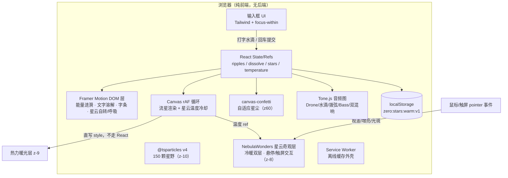
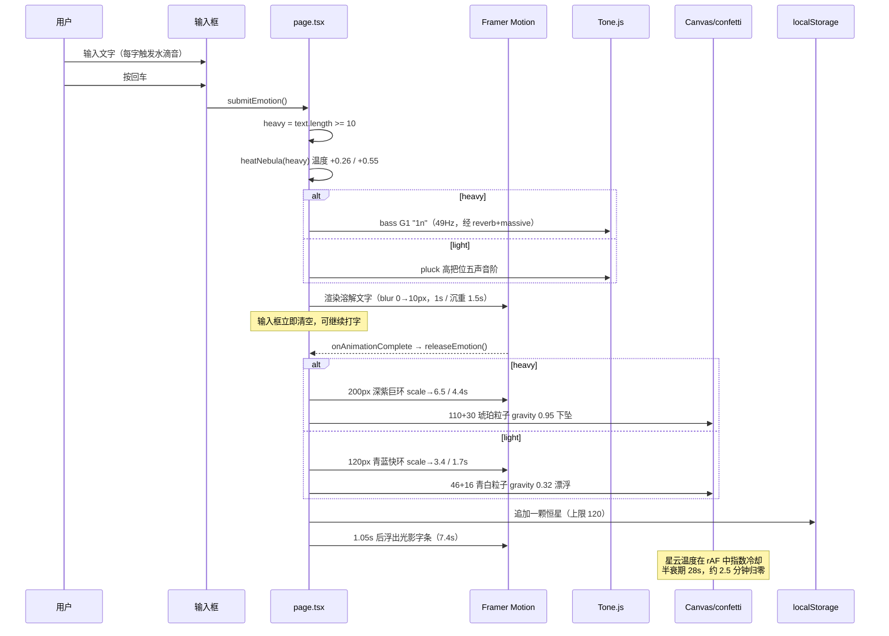
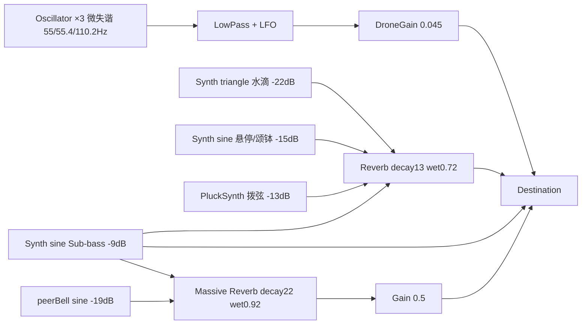

# 归零 Zero — 开发文档

> 一片可以把情绪丢进去的浩瀚深空。
> 线上地址：<https://xiaozeng2026.github.io/-zero-app-/>
>
> 当前版本：终极形态「宇宙深海 × 情绪自适应 × 星云热力学 × 同辈之网 × 星云奇观 × PWA × 生物钟 × 触觉 × 环保休眠」
> 文档更新日期：2026-10-02（基于 commit 13f855f）

---

## 1. 项目概述

「归零」是一个**零后端、零账号、零成本**的纯前端情绪承接 Web 应用。界面只有一个底部透明输入框：用户打字时有声、回车时文字溶解、情绪化为星尘与涟漪、最终凝成星穹中一颗持久的恒星。

设计三原则：

1. **极简 UI**——无按钮、无菜单、无说明文字，唯一可交互控件是输入框。
2. **冷色宇宙 + 暖色锚点**——深空蓝紫为底，情绪落点（恒星/文字/爆发）始终是暖金。
3. **被陪伴而不被打扰**——所有自动事件（流星、同辈涟漪）微弱、随机、低频。

---

## 2. 技术栈

| 类别 | 选型 | 版本 | 用途 |
|---|---|---|---|
| 框架 | Next.js（App Router，静态导出 `output: "export"`） | 16.3.6 | 单页渲染、产物为纯静态文件 |
| 语言 | TypeScript | ^5 | 全量类型 |
| UI | React | 19.2.8 | 状态与组合 |
| 样式 | Tailwind CSS（`@import "tailwindcss"` v4 模式） | ^4 | 原子类 + 少量自定义关键帧 |
| 星空 | @tsparticles/react + @tsparticles/slim（**v4**） | ^4.4.0 | 150 颗星点粒子层 |
| 动效 | framer-motion | ^13.4.4 | DOM 能量涟漪、文字溶解、字条、星云呼吸 |
| 星尘 | canvas-confetti | ^1.9.4 | 回车时的自适应粒子爆裂 |
| 音频 | Tone.js | ^15.1.22 | Drone / 水滴 / 拨弦 / Sub-bass / 混响风铃 |
| 图标 | lucide-react | ^1.49.0 | **已安装但当前未引用**（预留） |

> ⚠️ 不要安装或恢复 `react-tsparticles` / `tsparticles` v2。v4 引擎的安装脚本会检测废弃包并导致 `npm ci` 失败、CI 挂起。

---

## 3. 目录结构

```text
zero-app/
├── .github/workflows/deploy.yml   # GitHub Pages 自动部署
├── next.config.ts                 # output:"export" + BASE_PATH 子路径注入
├── postcss.config.mjs             # Tailwind v4 PostCSS 插件
├── package.json
├── public/
│   ├── sw.js                      # ★ Service Worker：导航网络优先 + 静态 SWR 离线缓存
│   ├── manifest.webmanifest       # （构建产物，由 src/app/manifest.ts 生成）
│   ├── icon.svg                   # ★ favicon：深空蓝晕 + 暖金恒星
│   ├── icon-192.png               # ★ PWA 图标 192
│   ├── icon-512.png               # ★ PWA 图标 512
│   ├── icon-maskable-512.png      # ★ PWA maskable 图标（星体缩 0.62 留安全区）
│   ├── apple-touch-icon.png       # ★ iOS 主屏图标 180
│   └── .nojekyll                  # 关闭 Pages 的 Jekyll 处理
└── src/
    ├── app/
    │   ├── layout.tsx             # 根布局：元信息/manifest/图标/appleWebApp/themeColor
    │   ├── manifest.ts            # ★ PWA 清单（force-static，BASE_PATH 前缀）
    │   ├── globals.css            # Tailwind 主题令牌 + 星云漂移/流光关键帧
    │   └── page.tsx               # ★ 页面编排：状态接线 + 提交流程 + JSX（约 380 行）
    ├── components/
    │   ├── StarfieldBackground.tsx # ★ 星空底座（渐变 + tsparticles）
    │   ├── NebulaWonders.tsx       # ★ 星云奇观层（宏大星云 + 悬停/触屏交互 + 温度联动）
    │   └── ServiceWorkerRegister.tsx # ★ load 后注册 sw.js（静默失败）
    ├── hooks/
    │   ├── useStarStorage.ts      # ★ 星穹存储：localStorage 恒星日记（增查限流）
    │   ├── useFxLayer.tsx         # ★ 特效层：涟漪/溶解/流星/热力/星尘/调度器 + RippleWave
    │   ├── useCircadianPhase.ts   # ★ 生物钟时段（深夜/白天/傍晚，边界自动切换）
    │   └── usePageVisibility.ts   # ★ 标签页可见性（useSyncExternalStore 订阅）
    └── lib/
        ├── audioEngine.ts         # ★ 音频引擎：Tone.js 单例（Drone/水滴/拨弦/Bass/双混响/生物钟/休眠）
        ├── circadian.ts           # ★ 生物钟 token 单一事实源（星速/波纹/底色/混响/Drone）
        └── haptics.ts             # ★ 触觉反馈（Vibration API 封装，iOS 静默无效）
```

代码分四块：

- `src/app/page.tsx`（约 380 行）：页面编排——状态接线、提交流程（自适应判断/IME 组词守卫）、字条、全部 JSX。
- `src/lib/audioEngine.ts`（约 160 行）：音频引擎模块级单例——初始化、`claimTime()`、六种音色触发、标签页挂起/恢复。
- `src/hooks/useStarStorage.ts`（约 90 行）：星穹存储 hook——localStorage 恒星日记的读取/落星/限流。
- `src/hooks/useFxLayer.tsx`（约 440 行）：特效层 hook——涟漪状态、文字溶解、流星 Canvas rAF、星云温度冷却、近场共鸣与同辈之网调度器、星尘爆裂、RippleWave 渲染组件。

---

## 4. 系统架构

### 4.1 分层总览（Mermaid）



### 4.2 视觉层级（z-index 约定）

| z-index | 层 | 说明 |
|---|---|---|
| `-10` | 星空底座 | 径向渐变 + 呼吸星云 + tsparticles |
| `-9` | 星云热力层 | 回车加热后的暗红/琥珀暖光，rAF 直写 opacity/scale |
| `-8` | 星云奇观层 | NebulaWonders：3 团宏大星云，blur 180-200px / screen 混合 / 自转呼吸 / 温度冷暖交叉淡化 / 悬停触屏交互 |
| `4/5` | 流星 Canvas | 仅负责流星拖尾与头部亮核 |
| `6` | DOM 能量涟漪 | 点击/回车/同辈三类波纹 |
| `10` | 恒星星穹 | localStorage 持久化恒星，可悬停发声 |
| `20` | 光影字条 + 溶解文字 | 居中浮字 |
| `30` | 输入框 | 唯一可交互控件 |
| `60` | confetti | 星尘爆裂（canvas-confetti 内置 zIndex） |
| `70` | 回归薄纱 | 从后台切回时 1.3s 黑纱缓出（环保休眠唤醒） |

所有特效层默认 `pointer-events: none`；点击交互通过 **window 上的 `pointerup` 监听**统一处理，并对 `input, button, a, p` 做豁免。

### 4.3 回车端到端时序



---

## 5. 核心逻辑

### 5.1 星空底座（StarfieldBackground）

- 底色：`radial-gradient(ellipse 120% 100% at 50% 42%, #020111, #01010a 48%, #000 82%)`。
- 两团星云：左上紫 `rgba(138,92,214)` / 右下蓝 `rgba(37,99,196)`，`blur(120px)`，Framer Motion 10s **反相** opacity+scale 呼吸。
- tsparticles v4 用法（注意 Provider 包裹）：

```tsx
<ParticlesProvider init={async (engine) => { await loadSlim(engine); }}>
  <Particles id="zero-starfield" options={options} />
</ParticlesProvider>
```

关键参数：150 颗、`size 0.4–1.6`、`links.enable = false`、`move.direction = "top"` + `random`、speed 0.1–0.3、twinkle 谷底 0.1。

### 5.2 星云奇观层（NebulaWonders）

`src/components/NebulaWonders.tsx`，位于星空底座（z-10）与热力层（z-9）之上、流星/涟漪之下，**纯视觉增量层，不承载业务逻辑**。

**静态结构**（3 团宏大星云，CLOUDS 数组定义）：

| 云团 | 位置 | size/blur | 冷色 | 暖色（燃烧态） | 自转 | 呼吸 | 视差/增亮 |
|---|---|---|---|---|---|---|---|
| 暗紫罗兰 | 左上天幕 | 82vmin / 180px | `rgba(88,28,135,…)` | 暗金→余烬红 | 140s | 34s ×1.22 | 22px / +0.20 |
| 深海青蓝 | 右下 | 88vmin / 190px | `rgba(14,116,144,…)` | 琥珀→焦橙 | -120s | 28s ×1.18 | 30px / +0.18 |
| 品红主体辉光 | 中央偏上（最大最淡） | 96vmin / 200px | `rgba(112,26,94,…)` | 暖金→赤红 | 170s | 40s ×1.26 | 14px / +0.15 |

每团云的 DOM 嵌套（各动效层解耦、互不干扰）：

```text
视差层 div (parallaxRef, rAF 直写 translate3d)
└─ motion.div 自转 (spin 120~170s 线性 360°)
   └─ motion.div 呼吸 (breathe 28~40s, scale 1→scalePeak→1)
      └─ 觉醒层 div (wakeRefs, rAF 直写 scale 1+wake≤1.04)
         ├─ 冷层 (coldLayersRef, rAF 直写 opacity，无 CSS transition)
         └─ 暖层 (hotLayersRef, opacity 跟随温度，CSS transition 4s 交叉淡化)
```

容器 `fixed inset-0 z-[-8] mix-blend-mode: screen pointer-events-none`。

**温度联动**：内部 250ms 低频采样 `tempRef.current`（page.tsx 的 `nebulaTempRef`），直写每团暖层 `style.opacity = T * hotGain`。升温时暖层 4s CSS 淡入（「燃烧」）；冷却时随 5.5 节的指数衰减花数分钟回归冷色。**冷层 opacity 不走 CSS transition**——rAF 与 CSS transition 写同一属性会互相打架。

**悬停/触屏交互**（全部 ref + rAF 惯性插值，零 React 重渲染）：

- 监听 window `pointermove / pointerdown / pointerup / pointercancel / pointerleave / blur / resize`。
- 鼠标：任意时刻驱动（hover 语义）。
- 触屏：仅手指**按下拖动**时驱动（`pointerdown` 记录 `touchId`，`pointermove` 校验 `pointerId`，`pointerup/cancel` 熄灭）；落在 `input, textarea, button, a, [data-no-glow]` 上的按压不触发（`closest()` 前做 `typeof el.closest === "function"` 防御，合成事件 target 可能是 window）。
- 每团云按指针到云心距离算感应强度 `prox`（云心=1，感应半径外线性衰减到 0；感应半径 = 云体半径 + 到视口中心的扁平补偿，保证视口内任意点可被覆盖又不全域同亮）。
- 每帧对每团云插值三个目标（LERP=0.045，沉重惯性）：
  - **视差吸引**：朝指针方向偏移，上限 `parallax` px；
  - **局部增亮**：冷层 `opacity = coldAlpha + hoverGlow * prox`；
  - **觉醒吸气**：`scale = 1 + wake`，`wake ≤ 0.04`。
- **指尖唤醒光斑**：52vmin 圆形柔光（blur 28px，白青紫 radial，screen 混合），GLOW_LERP=0.12 更贴手，`opacity = maxProx * 0.55`，`scale = 0.85 + o*0.3`；指针离开/抬起时淡出。
- `prefers-reduced-motion: reduce` 时整个交互 effect 不挂载（自转/呼吸由 Framer Motion 的全局降级处理）。

### 5.3 能量涟漪（RippleWave 组件）

- 数据模型：

```ts
interface RippleFx {
  id: number; x: number; y: number;
  tone: "violet" | "cyan" | "gold";
  supernova: boolean; dim: boolean;
  size?: number; scaleTo?: number; duration?: number; peak?: number; // 自适应覆盖
}
```

- 渲染：每个涟漪是两个 `motion.div` 圆环（外环 + 延迟 0.18s 的内环 0.62 倍），`box-shadow` 外发光 + inset 内发光 + radial-gradient 芯。
- 状态数组硬上限 **25** 个（`slice(-24)`）；外环 `onAnimationComplete` 时按 id 清除，避免内存与 DOM 堆积。
- 三种来源：

| 来源 | 触发 | 参数 |
|---|---|---|
| 指尖点击 | window `pointerup` | 随机 violet/cyan，scale→4，2.5s，peak 0.6，同时播放颂钵 |
| 回车释放 | `releaseEmotion` | 轻：cyan 120px→3.4/1.7s；重：violet 200px→6.5/4.4s |
| 同辈之网 | 独立慢定时器 | 105px→2.8/3.8s，peak 0.1–0.2，屏幕边缘 |

### 5.4 情绪自适应（Adaptive Resonance）

分档阈值常量 `HEAVY_THRESHOLD = 10`（按 `text.trim().length`，即字符数，中英文等价）。

| 维度 | 轻度 (<10) | 沉重 (≥10) |
|---|---|---|
| 星尘颜色 | 青蓝亮白 `CONFETTI_LIGHT` | 暗金琥珀 `CONFETTI_HEAVY` |
| 粒子数量 | 46 + 16 逃逸 | 110 + 30 余烬 |
| 重力 gravity | 0.32（失重漂浮） | 0.95（明显下坠） |
| ticks | 200 | 300 |
| 音色 | `Tone.PluckSynth`（Karplus-Strong 拨弦） | `Tone.Synth` 正弦 G1（49Hz）`"1n"` |
| 涟漪 | cyan 120px / scale 3.4 / 1.7s | violet 200px / scale 6.5 / 4.4s / 39px 强辉光 |
| 文字溶解时长 | 1s | 1.5s |
| 星云加热量 | +0.26 | +0.55 |

### 5.5 星云热力学（Non-linear Energy Dissipation）

- 温度存于 `nebulaTempRef`（**ref 而非 state**，取值 0–1），避免 60fps 触发 React 渲染。
- 加热：回车时 `T = min(1, T + Δ)`。
- 冷却：复用流星 Canvas 的 `requestAnimationFrame(ts)` 循环，按真实时间差做**指数衰减**：

```ts
T *= Math.pow(0.5, dt / NEBULA_COOL_HALFLIFE); // 半衰期 28 秒
if (T < 0.002) T = 0;                          // 死区，彻底归零
```

5 个半衰期 ≈ 140 秒（约 2.5 分钟）回冰冷深空；前期降得快、后期尾韵极长，符合「非线性极慢冷却」。
- 输出：变化量超过 0.003 时才直写热力层 DOM：`opacity = T*0.85`、`transform = scale(1 + T*0.22)`。热力层为 blur(70px) 的暗红→琥珀径向渐变，位于 z-9。
- `dt` 用 `Math.min(0.1, …)` 钳制，切后台造成的大时间跳变不会让温度瞬间清零。

### 5.6 同辈之网（Silent Peer Support Network）

- 独立 `useEffect` 中的 **setTimeout 自调度链**（与流星/近场共鸣调度器完全分离），间隔 `15000 + random*30000` ms（15–45s）。
- 坐标：屏幕四条极边缘带（左右各 8% 宽、上下各 12% 高）内随机一点。
- 视觉：近乎透明的紫/青小涟漪（peak 0.1–0.2）。
- 听觉：`peerBell`（正弦、-19dB）随机五声音阶，只送入 **Massive Reverb**（decay 22s，wet 0.92，经 Gain 0.5 输出）。
- `document.hidden` 时跳过本轮（不发声、不生成），定时器继续走。

> 另有「近场共鸣」调度器（5–12s，开启减弱动效时 11–19s）：65% 生成 Canvas 流星（25% 金色）、35% 生成普通暗涟漪，播放常规 bell。两套循环寓意不同，勿合并。

> **隐私说明**：同辈之网为本地模拟——涟漪坐标与触发时机全部在浏览器内随机生成，无任何网络请求、无任何数据上传；本应用不采集任何数据。

### 5.7 生成式音频（Tone.js 音频图）



关键约束：

- 首次 `pointerdown`/`keydown` 时 `await Tone.start()` 懒初始化（浏览器自动播放策略），Promise 缓存保证幂等；两个 Reverb 顺序 `await reverb.generate()`。
- 所有 `triggerAttackRelease` 必须使用 `claimTime()` 返回的**严格递增时间戳**：

```ts
const t = Math.max(Tone.now(), nextNoteTimeRef.current + 0.001);
```

否则快速连点会抛 `Start time must be strictly greater than previous start time`。

- Drone：3 支振荡器（第三支 110.2Hz 增益 0.25）→ 低通 150Hz → 0.08Hz LFO 让截止频率 90–220Hz 呼吸；初始化后 6s 淡入到 0.045。

> 实现位于 `src/lib/audioEngine.ts`（模块级单例）：`ensureAudio()` 幂等初始化，音色以 `playDrop / playPluck / playBassG1 / playBell / playBellThrottled / playPeerBell` 语义化导出，标签页挂起/恢复为 `suspendAudio() / resumeAudio()`。

### 5.8 星穹与本地持久化（useStarStorage）

- Key：`zero:stars:warm:v1`；仅客户端 `useEffect` 内读取，规避 SSR hydration mismatch。
- 结构：

```ts
interface Star {
  id: string;
  x: number; // 视口宽度百分比
  y: number; // 6–40，只落上半屏
  size: number; color: string;
  twinkle: number;  // 闪烁周期（秒），落盘以保持稳定
  timestamp: number;
}
```

- 每次回车落一颗（位置/大小/色/周期随机），写入前 `slice(-120)` 限流；`setItem` 包 try/catch，存储不可用也不影响体验。
- 悬停/触摸恒星：放大发亮 + `playBellThrottled()`（0.12s 节流）随机五声音阶。

### 5.9 光影字条

回车后 1.05s 浮出，从 5 条低语中抽取且**不与上一条重复**；Framer Motion 7.4s 时间轴：blur(10→2→2→14px)、opacity `[0,1,1,0]`，结束 `setWhisper(null)`。

### 5.10 输入框视觉（纯 CSS，零状态）

容器 `group` + `focus-within` 实现三态，不增加任何 React 状态：

- 静息：112px（w-28）发丝横线、两端微光星点、背后暖光 opacity 0.3。
- 聚焦：文字暖金辉光（text-shadow 14→26px）、横线延展至 288px（w-72）并透琥珀辉光、星点放大点亮、暖光晕全亮、`.zero-line-shimmer` 流光 3.6s 沿海平线游移。
- 有字未聚焦：横线保持延展微亮（由 `value.trim()` 切换类）。
- 流光关键帧定义在 `globals.css`，`prefers-reduced-motion: reduce` 时关闭。

**IME 组词守卫**（修复中文输入法误判）：

- 组词（拼音未上屏）期间的回车 = 确认拼音/选字，不是提交意图。onKeyDown 中依次检查 `e.nativeEvent.isComposing`、`keyCode === 229`（主流浏览器）、`composingRef`（onCompositionStart/End 维护）、以及「compositionend 后 100ms 内」时间窗（部分安卓 IME 的提交回车晚于 compositionend 触发），命中任一即不提交。
- 组词中不逐键响水滴（拼音字母每键 onChange 都会触发，逐键发声会把 "wanshang" 变成 8 声水滴）；仅整词上屏（compositionend）后响一声。
- 受控 input 在组词期间仍正常 `setValue`（React 受控输入必须同步组词文本，否则 IME 卡死）。

### 5.11 PWA：装到主屏与离线

目标是让「归零」在手机桌面像原生 App 一样全屏启动，且弱网/离线可打开。

**清单 `src/app/manifest.ts`**（`export const dynamic = "force-static"`，静态导出必需）：

- `name "归零 Zero"` / `short_name "归零"`、`display "standalone"`、`orientation "any"`；
- `start_url` / `scope` 均为 `${basePath}/`（CI 注入 `/-zero-app-`），保证装在子路径下也能正确回跳；
- `background_color #000000`、`theme_color #020111`；
- 三图标：192/512 `purpose "any"` + 512 `purpose "maskable"`（maskable 版星体缩至 0.62，预留 Android 自适应图标的裁切安全区）。

**元信息 `layout.tsx`**：`metadata.manifest`、`icons.icon`（icon.svg + icon-192.png）、`icons.apple`（apple-touch-icon.png）、`appleWebApp {capable, title "归零", statusBarStyle "black-translucent"}`；`viewport.themeColor = "#020111"`（与深空底色一致，启动时不露白）。

**图标**：`public/` 下 1 个 SVG + 4 个 PNG。PNG 由 PowerShell `System.Drawing` 脚本生成：黑底 + 深空蓝晕 + 左上紫晕 + 星点 + 中央暖金恒星多层辉光。径向渐变用**环形带（annulus）逐段填充**（`FillPath` 外圈减内圈、关 SmoothingMode 避免带间接缝、仅星点开抗锯齿）消除 GDI+ 同心环带。

**Service Worker `public/sw.js`**（cache 名 `zero-shell-v1`，scope 由注册位置天然限定到子路径）：

- `install`：预缓存 `manifest.webmanifest`（外壳失败无妨，运行时会补）→ `skipWaiting()`；
- `activate`：清旧 cache → `clients.claim()`；
- `fetch`：仅处理同源 GET。**页面导航网络优先**（成功时刷新外壳缓存、失败回退缓存外壳），**其余静态资源 Stale-While-Revalidate**（带 hash 的 JS/CSS/图标先出缓存、后台更新）。

**注册 `ServiceWorkerRegister.tsx`**：`"use client"` 空组件，`load` 事件后 `navigator.serviceWorker.register(new URL("./sw.js", location.href))`，`catch` 静默——非安全上下文（如 file://）或禁用时不影响任何功能。挂在 `layout.tsx` body 尾部。

### 5.12 标签页可见性与环保休眠（usePageVisibility）

`src/hooks/usePageVisibility.ts` 用 `useSyncExternalStore` 订阅 `visibilitychange`，返回 `document.hidden`，无轮询。`page.tsx` 据此驱动休眠/唤醒（标题变化与音频解耦，引擎未初始化也安全）：

**切走 / 后台 / 锁屏（hidden）**：

- `document.title = "…"`（极简静默信号）；
- `sleepAudio()`：Drone gain 在 **0.5s 内线性淡出到近零** → 挂起整个 `AudioContext`（混响长尾一并冻结、释放音频硬件）；
- `<StarfieldBackground paused>`：`container.pause()` 暂停 tsparticles 渲染循环（CPU/GPU 降载）；
- 流星 canvas 的 rAF 由浏览器在隐藏标签页自动节流，两个共鸣调度器本来就有 `document.hidden` 闸门，不额外处理。

**切回（visible）**：

- `wakeAudio()`：必要时先 `ctx.resume()`，Drone 从寂静在 **1.6s 内线性淡入**到当前时段目标音量；若用户在 0.6s 挂起窗口内快速切回则取消挂起、只做音量回弹；
- 粒子 `container.play()` 恢复；
- 一层纯黑薄纱（z-70）**1.3s 缓出**，画面与声音同步温柔回归，杜绝突然吵闹/刺眼。薄纱纪元（veilEpoch）在渲染期检测 `hidden` 翻转推进，首挂不触发。

### 5.13 副作用生命周期清单

| Effect / 定时器 | 职责 | 清理 |
|---|---|---|
| 启动 effect（useStarStorage） | 读取 localStorage 星穹 | 无需清理 |
| 音频解锁 effect（page.tsx） | 首次手势 `ensureAudio()` | removeEventListener |
| 生物钟 effect（page.tsx） | phase 变化 → `applyCircadianPhase()`（参数 4s 平滑） | 无需清理 |
| useCircadianPhase 定时器 | 到下一边界（00/06/19 点）后切换时段 | clearTimeout |
| 可见性 effect（page.tsx） | 标题静默 + sleepAudio/wakeAudio | 无（单页不卸载） |
| 点击涟漪 effect（useFxLayer） | window pointerup + 触觉 tick | removeEventListener |
| Canvas effect（useFxLayer） | resize、rAF 流星+温度冷却、近场共鸣 setTimeout | cancelAnimationFrame + clearTimeout + removeEventListener |
| 同辈之网 effect（useFxLayer） | 15–45s setTimeout 链 | clearTimeout |
| 星空暂停 effect（StarfieldBackground） | paused 变化 → tsparticles container pause/play | 无需清理 |
| NebulaWonders 温度 effect | 250ms 采样 tempRef 直写暖层 opacity | clearInterval |
| NebulaWonders 悬停/触屏 effect | pointer 系列监听 + rAF 惯性插值（reduced 时不挂载） | cancelAnimationFrame + removeEventListener ×7 |
| ServiceWorkerRegister effect | load 后注册 sw.js | removeEventListener |
| whisperTimer（page.tsx） | 字条延迟 | 卸载时 clearTimeout |

长生命周期调度器通过 `rippleApiRef`（每次 render 同步为最新 `addRipple`）向状态层写入，避免闭包捕获旧 state。

### 5.14 生物钟环境微调（Circadian Ambience）

`src/lib/circadian.ts` 是**全天参数唯一事实源**（token 化，各视觉/音频层只消费、不硬编码时段值）：

| 时段（本地时间） | 底色薄纱 | 星尘漂浮速度 | 波纹节奏 | 星云 | 主混响 | Drone 音量 | Drone 低通 LFO |
|---|---|---|---|---|---|---|---|
| night 深夜 00–05 | 纯黑 0.55（压成近纯黑） | 0.06–0.18（最慢） | 1.08× 沉缓 | ×0.82 压暗 | 0.82 最大 | 0.040 最远 | 80–180Hz 闷 |
| day 白天 06–18 | 深海蓝 `#0a1c3d` 0.28 微透 | 0.12–0.36 稍快 | 0.92× 轻快 | 1.00 | 0.66 稍干 | 0.052 稍清晰 | 130–280Hz 透 |
| evening 傍晚 19–23 | 无薄纱（基准态） | 0.10–0.30 | 1.00× | 1.00 | 0.72 | 0.045 | 90–220Hz |

- `useCircadianPhase()`：初始按时长判定，并 setTimeout 到下一边界（00:00/06:00/19:00）后自动切换——页面整夜不关也能在凌晨 6 点自然"天亮"。
- **底色过渡**：CSS 渐变不可平滑插值，因此在固定渐变上盖一层纯色薄纱，用 `opacity 3s transition` 换天，无闪烁。
- **星速切换**：options 变化触发 tsparticles 容器重建（一天最多 2 次，发生在整点边界）。
- **音频切换**：`applyCircadianPhase()` 对 `reverb.wet`/`droneGain.gain` 做 4s `rampTo`，LFO `min/max` 数值 setter 即时改区间；引擎未初始化时缓存 phase，`ensureAudio()` 末尾按当前时段构建。

### 5.15 触觉反馈（Haptic Resonance）

`src/lib/haptics.ts` 对 Vibration API 的极简封装（try/catch 防御跨域 iframe；iOS Safari 无此 API，静默无效）：

- **点击涟漪**：`navigator.vibrate(10)`——极轻一啄。只挂在 window pointerup 监听里；近场共鸣/同辈之网的自动涟漪走 `rippleApiRef`，**不会误震**。
- **回车粉碎**：字数 <10 → `vibrate(20)` 短震；字数 ≥10 → `vibrate([30,50,30])` 震-停-震，模拟重物落地的物理回弹。

---

## 6. 本地开发

环境：Node.js 20+（CI 使用 20），npm。

```bash
npm install        # 安装依赖
npm run dev        # http://localhost:3000，BASE_PATH 留空
npm run build      # 静态导出到 out/
npm run lint       # ESLint
```

无环境变量、无后端服务、无数据库。`BASE_PATH` 仅在构建期使用（见下节），本地开发不需要设置。

### 手工验收清单

1. 点击星空空白：出现紫/青发光圆环，约 2.5s 消失；点输入框/恒星/字条**不**出涟漪。
2. 输入 <10 字回车：青蓝快环、青白漂浮星尘、拨弦音；输入 ≥10 字：深紫慢巨环、琥珀下坠星尘、G1 低音。
3. 回车后观察背景暖光（热力层 + 星云暖层 4s 内「燃烧」为暗金琥珀），约 2.5 分钟完全冷却回深蓝。
4. 刷新页面：恒星仍在（localStorage）。
5. 等待 15–45s：屏幕边缘出现极淡涟漪并伴随遥远风铃。
6. 鼠标在星空间缓慢移动：附近星云被轻轻吸引、微微增亮，指尖有柔光跟随；移出窗口后缓慢回弹。
7. 触屏（手机/模拟器）：手指按住星空拖动，光斑跟手、附近星云发亮；抬起熄灭。按在输入框上不触发。
8. 切到其他标签页：标题变「…」，音频静默；切回恢复标题与音频。
9. DevTools → Application → Manifest 可识别三图标、standalone；Service Workers 显示 `zero-shell-v1` activated；Network 勾选 Offline 刷新仍可打开。
10. 中文输入法组词中按回车：仅确认拼音/选字，不提交情绪；整词上屏后只响一声水滴。
11. 生物钟：按当前本地时间整站氛围不同（深夜更黑更慢混响更大）；可临时改系统时间跨边界验证自动换天。
12. 切走标签页：标题变「…」，DevTools 可见 tsparticles 暂停、AudioContext suspended；切回时黑纱缓出、Drone 平滑淡入。
13. Console 无 `Start time must be strictly greater …`、无 tsparticles / React key 报错。

> 自动化浏览器在隐藏标签页会冻结 rAF，测流星/冷却时确认 `document.visibilityState === "visible"`；浏览器脚本内 `await sleep` 累计超过约 15s 可能导致 evaluate 返回 undefined，拆成 6–8s 短脚本执行。

---

## 7. 部署说明（GitHub Pages）

项目为项目站（`https://用户名.github.io/仓库名/`），资源路径必须带子路径前缀。

- `next.config.ts`：

```ts
const basePath = process.env.BASE_PATH ?? "";
const nextConfig = {
  output: "export",
  basePath,
  images: { unoptimized: true },
  trailingSlash: true,
};
```

- `.github/workflows/deploy.yml`：push 到 `main` 触发，Node 20 → `npm ci` → 以 `BASE_PATH=/${仓库名}` 执行 `npm run build` → 上传 `./out` → `deploy-pages`。
- 仓库需在 **Settings → Pages → Source = GitHub Actions**。
- 每次 push main 后约 1–2 分钟生效；Pages/CDN 缓存最长约 10 分钟，手机端可能需要下拉刷新。

### 推送（网络受限环境）

push 遇到 connection reset / schannel close_notify 时，用**一次性代理**（不写入 git config）并重试：

```powershell
git -c http.proxy=http://127.0.0.1:17890 -c https.proxy=http://127.0.0.1:17890 push origin main
```

### 部署后校验

用 GitHub API 查 Actions：`GET /repos/<owner>/<repo>/actions/runs?per_page=1`，`conclusion = success` 后，拉取线上 HTML 提取 `/_next/static/...` chunk 路径，检查 JS/CSS 中是否包含本次特征字符串（如 `zero-line-shimmer`、`blur(70px)`、`supernova`、`zero:stars:warm:v1`）。

---

## 8. 约束与常见问题

- **静态导出限制**：不能使用服务端 API、Route Handler、Next 图片优化（已 `unoptimized`）、服务端运行时依赖；`manifest.ts` 必须 `export const dynamic = "force-static"`。
- **tsparticles 必须 v4**：包名为 `@tsparticles/react` + `@tsparticles/slim`，用 `ParticlesProvider` 包裹 `Particles`。
- **音频时间戳**：任何 Synth 触发都走 `claimTime()`。
- **温度写 DOM 不写 state**：所有高频（rAF）视觉变化直写 style，防止 React 每秒 60 次重渲染。
- **rAF 与 CSS transition 不写同一属性**：星云冷层 opacity 由 rAF 每帧驱动（无 transition），暖层 opacity 由 CSS 4s 过渡驱动（rAF 只低频写入）；混用会互相打架。
- **动效层 DOM 解耦**：星云的视差/自转/呼吸/觉醒分别落在四层嵌套 div 上，互不争抢 transform。
- **触屏合成事件防御**：`e.target` 可能是 window，调 `closest()` 前先 `typeof el.closest === "function"`。
- **Service Worker scope**：部署在子路径时不要写死 `/sw.js`，用 `new URL("./sw.js", location.href)` 让 scope 天然限定在子路径。
- **国内可达性**：优先 GitHub Pages 而非 Vercel 域名（后者在部分国内移动网络/微信内置浏览器中不可达）。
- **隐私**：全应用无后端、无统计、无网络请求（除 GitHub Pages 静态资源本身）；星穹日记只存本机 localStorage，同辈之网为本地模拟。
- **IME**：受控 input 必须在组词期间正常 `setValue`，回车提交须过 composition 守卫（见 5.10）。
- **生物钟 token 单一事实源**：所有时段参数只准写在 `src/lib/circadian.ts`，组件经 props 消费；新增随时间变化的视觉/音频参数时往 token 表加一列，勿在组件里判小时。
- **渐变不可过渡**：背景换天用纯色薄纱 opacity 过渡，不要指望 `transition: background` 插值渐变。
- **休眠淡出先于挂起**：先 ramp gain（≥0.5s）再 `ctx.suspend()`，恢复必须 `resume()` 之后再排淡入曲线（挂起期间 Tone 传输时间不前进）。
- **触觉只跟真人手势**：自动涟漪（近场共鸣/同辈网）严禁调用振动，只有用户 pointerup/提交可震；Vibration API 不可用时静默。
- **可访问性**：`prefers-reduced-motion` 下自动事件降频、星云漂移/悬停交互/流光关闭；confetti `disableForReducedMotion`；viewport 禁止缩放是刻意的沉浸式取舍。

---

## 9. 版本记录

| 日期 | Commit | 内容 |
|---|---|---|
| 2026-10-02 | `13f855f` | 底层质感三增强：触觉反馈（Vibration）/ 生物钟环境（circadian token：底色薄纱+星速+波纹+混响+Drone）/ 环保休眠（Drone 淡出挂起 + tsparticles 暂停 + 1.3s 回归薄纱） |
| 2026-10-02 | `28c90f2` | 重构：删除 7 个旧组件死代码（净 -1355 行）/ page.tsx 拆为音频引擎+星穹存储+特效层三模块 / 修复 IME 组词回车误提交 |
| 2026-10-02 | `7a2574c` | README v1.1：补充星云奇观层/悬停触屏/PWA/可见性四模块 |
| 2026-10-02 | `850c7af` | 移动端陪伴：触屏拖动光斑 + PWA（manifest + SW + 深空图标）+ 标签隐藏 suspend 音频 + 标题静默「…」 |
| 2026-10-01 | `8b4a9af` | 星云悬停增强：指尖唤醒光斑 + 悬停云觉醒吸气放大（1.04x） |
| 2026-10-01 | `08dc9b1` | 星云悬停交互：鼠标靠近被吸引（视差偏移 + 惯性 LERP 0.045）与局部增亮，离开缓慢回弹 |
| 2026-10-01 | `2b10d0b` | 星云奇观层：3 团宏大星云（blur 180-200px / screen 混合 / 120-170s 自转 / 28-40s 呼吸）/ 冷暖双层按星云温度 4s 交叉淡化 |
| 2026-10-01 | `75f30d2` | 完整开发文档 |
| 2026-10-01 | `94d0a53` | 输入框视觉：呼吸暖光 / 地平线发丝线 / 星点 / 流光 |
| 2026-10-01 | `f26866d` | 终极重构：情绪自适应 + 星云热力学 + 同辈之网 |
| 2026-10-01 | `8c114cf` | 宇宙深海：Framer Motion DOM 能量涟漪 / 文字 blur 溶解 / 暖金超新星 / 150 星 |
| 更早 | `6b731af` 等 | 温暖版单页首页、tsparticles v4、confetti、星穹日记、Tone.js 音频 |

*文档版本 v1.3 · 更新于 2026-10-02，基于 commit 13f855f 的代码现状（生物钟 / 触觉 / 环保休眠）。*
